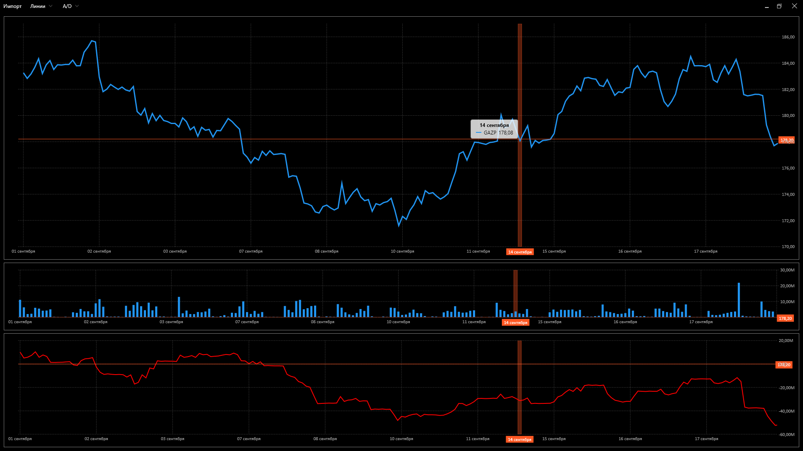
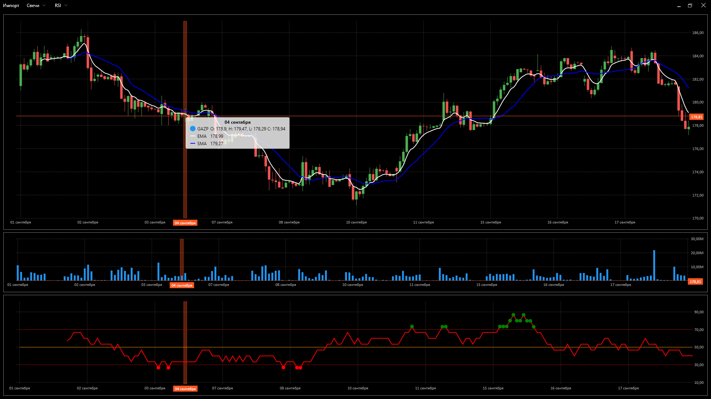

# MQ_Visualisator
Simple program for market quotations analysis.

Программа для визуализации котировок, а также их анализа при помощи различных индикаторов:

1. RSI
2. MACD
3. SMA
4. EMA
5. A/D

Примеры работы программы:

